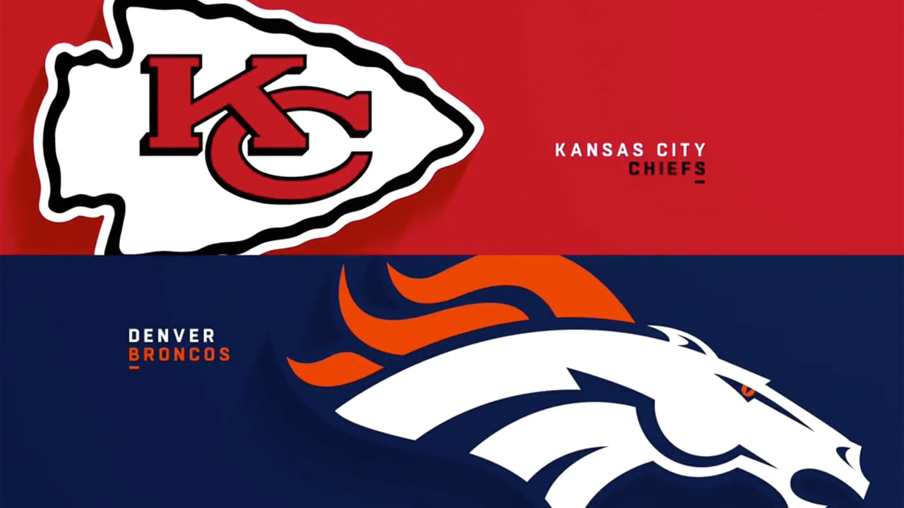

<!-- 
   Name:    Dustin Memmott
   Class:   CS2550 - Fall 2020
   Date:    12/06/20
   Project: Final P2
-->

<!DOCTYPE html>
<html lang="en">
   <meta charset="UTF-8">
   <title>Dustin's Website</title>
   <link rel="stylesheet" href="css/styles.css"> 

   <!-- Home Page -->
   <body class="grid-container">
      <header class="Header">
         
         
Kansas City Chiefs Fan

      </header>
      
      <aside class="Aside">
         <nav>
            <button onclick='toggle("buttonHome")'>Home</button>
            <button onclick="toggle('buttonPlayers')">Players</button>
            <button onclick='toggle("buttonStandings")'>Standings</button>
            <button onclick='toggle("buttonLog")'>Log Visit</button>
         </nav>
         

KS vs HOU

34 - 20

         

KS vs LAC

23 - 20

         

KS vs BAL

34 - 20

         

KS vs NE

26 - 10

         

KS vs LAV

32 - 40

         

KS vs BUF

26 - 17

         

KS vs DEN

43 - 16

         

KS vs NYJ

35 - 9

      </aside>

      <main class="Main">
         <section id="Main"> <!-- HOME -->
            

               
Home Page

            
 
            

               <a class="article_title" href="https://www.arrowheadpride.com/2020/12/6/22155628/five-things-to-watch-as-the-chiefs-host-the-broncos-nfl-week-13" target="_blank">
                  Five things to watch as the Chiefs host the Broncos
               </a>
               
               

                  As chaotic and abnormal as the NFL season has been, all 32 teams have stayed well-enough intact to play their entire schedule
                   — and one of them will be winning a Lombardi Trophy. At this point of the campaign, the Kansas City Chiefs look to be as able 
                   as any other team — if not more so — to pull it off...
               

            

            

               <a class="article_title" href="https://www.si.com/nfl/chiefs/podcasts/patrick-mahomes-biggest-competition-for-mvp" target="_blank">
                  Who is Mahomes' Biggest Competition for MVP?
               </a>
               

                  As the midway point of the season has come and gone, the conversation for NFL's Most Valuable Player is heating up. With Kansas 
                  City Chiefs quarterback Patrick Mahomes in the conversation for the award, let's take a look at other players that could be in 
                  contention for the MVP... Arrowhead Report's Mark Van Sickle joined me on today's Roughing the Kicker to break down the MVP race.
               

               
               
 
                  this season and assess Mahomes' chances of bringing home the second regular-season MVP award of his career. With 2,687 yards, 
                  25 touchdowns and one interception through nine games, Mahomes hasn't missed a step since his first season as the starter in 2018... 
               

            

            

               <a class="article_title" href="https://www.youtube.com/embed/pO6jFrgWh18" target="_blank">
                  Patrick Mahomes Highlights
               </a>
               <iframe width="560" height="315" src="https://www.youtube.com/embed/pO6jFrgWh18" frameborder="0" allow="accelerometer; autoplay; clipboard-write; encrypted-media; gyroscope; picture-in-picture" allowfullscreen></iframe>
            

         </section>

         <section id="Players"> <!-- PLAYERS -->
            

               
Players

            
 

            

               

                  
               

               

                  
<b>Name: </b> Patrick Mahomes

                  
<b>Number: </b> 15

                  
<b>Position: </b> QB

                  
<b>Age: </b> 25

                  
<b>Height: </b> 6'3"

                  
<b>Weight: </b> 230lbs

                  
<b>Hometown: </b> Tyler, TX

               

               

                  
<b>Touchdowns:</b> 30

                  
<b>Interceptions:</b> 2

                  
<b>Passing Yards:</b> 3,497

                  
<b>Rushing Yards:</b> 215

               

            

            

               

                  
               

               

                  
<b>Name: </b>Tyreek Hill

                  
<b>Number: </b> 10

                  
<b>Position: </b> WR

                  
<b>Age: </b> 26

                  
<b>Height: </b> 5'10"

                  
<b>Weight: </b> 185lbs

                  
<b>Hometown: </b> Lauderhill, FL

               

               

                  
<b>Touchdowns:</b> 13

                  
<b>Targeted:</b> 101
                  
                  
<b>Receptions:</b> 68

                  
<b>Receiving Yards:</b> 1,021

               

            

            

               

                  
               

               

                  
<b>Name: </b>Travis Kelce

                  
<b>Number: </b> 87

                  
<b>Position: </b> TE

                  
<b>Age: </b> 31

                  
<b>Height: </b> 6'5"

                  
<b>Weight: </b> 260lbs

                  
<b>Hometown: </b> Westlake, OH

               

               

                  
<b>Touchdowns:</b> 13

                  
<b>Targeted:</b> 101
                  
                  
<b>Receptions:</b> 68

                  
<b>Receiving Yards:</b> 1,021

               

            

         </section>   
         <section id="Standings"> <!-- STANDINGS -->
            

               
Standings

            
 
            

               
AFC WEST Standings

               <table>
                  <thead>
                    <tr>
                      <th>Team</th>
                      <th>Wins</th>
                      <th>Loses</th>
                      <th>Ties</th>
                      <th>Percentage</th>
                      <th>Home</th>
                      <th>Away</th>
                      <th>Streak</th>
                    </tr>
                  </thead>
                  <tbody>
                    <tr>
                      <td>Chiefs</td>
                      <td>10</td>
                      <td>1</td>
                      <td>0</td>
                      <td>.909</td>
                      <td>4-1</td>
                      <td>6-0</td>
                      <td>W6</td>
                    </tr>
                    <tr>
                      <td>Raiders</td>
                      <td>7</td>
                      <td>5</td>
                      <td>0</td>
                      <td>.583</td>
                      <td>2-3</td>
                      <td>5-2</td>
                      <td>W1</td>
                    </tr>
                    <tr>
                      <td>Broncos</td>
                      <td>4</td>
                      <td>7</td>
                      <td>0</td>
                      <td>.364</td>
                      <td>2-4</td>
                      <td>2-3</td>
                      <td>L1</td>
                    </tr>
                    <tr>
                      <td>Chargers</td>
                      <td>3</td>
                      <td>9</td>
                      <td>0</td>
                      <td>.250</td>
                      <td>2-4</td>
                      <td>1-5</td>
                      <td>L2</td>
                    </tr>
                  </tbody>
               </table>
            

            

               
AFC Standings

               <table>
                  <thead>
                    <tr>
                      <th>Team</th>
                      <th>Wins</th>
                      <th>Loses</th>
                      <th>Ties</th>
                      <th>Percentage</th>
                      <th>Home</th>
                      <th>Away</th>
                      <th>Streak</th>
                    </tr>
                  </thead>
                  <tbody>
                    <tr>
                      <td>Steelers</td>
                      <td>11</td>
                      <td>0</td>
                      <td>0</td>
                      <td>1.0</td>
                      <td>6-0</td>
                      <td>5-0</td>
                      <td>W11</td>
                    </tr>
                    <tr>
                     <td>Chiefs</td>
                     <td>10</td>
                     <td>1</td>
                     <td>0</td>
                     <td>.909</td>
                     <td>4-1</td>
                     <td>6-0</td>
                     <td>W6</td>
                   </tr>
                    <tr>
                      <td>Bills</td>
                      <td>8</td>
                      <td>3</td>
                      <td>0</td>
                      <td>.727</td>
                      <td>5-1</td>
                      <td>3-2</td>
                      <td>W1</td>
                    </tr>
                    <tr>
                      <td>Titans</td>
                      <td>8</td>
                      <td>4</td>
                      <td>0</td>
                      <td>.667</td>
                      <td>4-3</td>
                      <td>4-1</td>
                      <td>L1</td>
                    </tr>
                    <tr>
                     <td>Browns</td>
                     <td>9</td>
                     <td>3</td>
                     <td>0</td>
                     <td>.750</td>
                     <td>5-1</td>
                     <td>4-2</td>
                     <td>W4</td>
                   </tr>
                  </tbody>
               </table>
            

         </section>

         <section id="Log">
            

               
Visitor Form

            

            

               
Thank you for logging your visit!

             

             <form id="myform">
               

                  

                     <label for="first-name">First Name</label>
                     <input type="text" id="first-name" name="first-name" placeholder="Enter your first name here" required>
                     
First Name is Required

                  

                  

                     <label for="last-name">Last Name</label>
                     <input type="text" id="last-name" name="last-name" placeholder="Enter your last name here" required>
                     
Last Name is Required
 
                  

               

               

                  

                     <label for="address">Address</label>
                     <input type="text"  id="address" name="address" placeholder="Enter your address here" required>
                     

                  

                  

                     <label for="city">City</label>
                     <input type="text"  id="city" name="city" placeholder="Enter your city here" required>
                     

                  

               

               

                  

                     <label for="state">State</label>
                     <input type="text"  id="state"  name="state" placeholder="Enter your state here" required>
                     
Please enter a two character state code

                  

                  

                     <label for="zip">Zip</label>
                     <input id="zip" name="zip" type="text" placeholder="Enter a zip code here" maxlength="5" minlength="5" pattern="^\d{5}$" required>
                     
You must enter a valid Zip Code

                  

               

               

                  

                     <label for="email">Email</label>
                     <input type="email" id="email" name="email" placeholder="Enter your email here" required>
                     
You must enter a valid email

                  

                  

                     <label for="phone">Phone</label>
                     <input type="phone" id="phone" placeholder="Enter your phone here" minlength= "10" maxlength="12" pattern="([0-9]{3}-[0-9]{3}-[0-9]{4})|([0-9]{10})" required>
                     
You must enter a valid phone number

                  

               

               
               

                  <h3>How did you find my page?</h3>
               

               

                  <ul class="inline-flex">
                     <li>
                        <input type="checkbox" id='google' name='find-page' value="google">
                        <label for="google">Google Search</label>
                     </li>
                     <li>
                        <input type="checkbox" id='friend' name='find-page' value="friend">
                        <label for="friend">Friend</label>
                     </li>
                     <li>
                        <input type="checkbox" id='newspaper' name='find-page' value="newspaper">
                        <label for="newspaper">News Paper</label>
                        
You must check at least one

                     </li>
                  </ul>
               

               

                  <label for="comment">Comments</label>
                  <textarea rows="4" id="comment" placeholder="Enter your comments here"></textarea>
               

               

                  <button id="formSubmit" type="submit">Submit</button>
               

            </form>
         </section>
      </main>

      <footer class="Footer">
         
This is a fan site and not to be taken seriously.

      </footer>

    
   
   
   

   </body>
</html>

